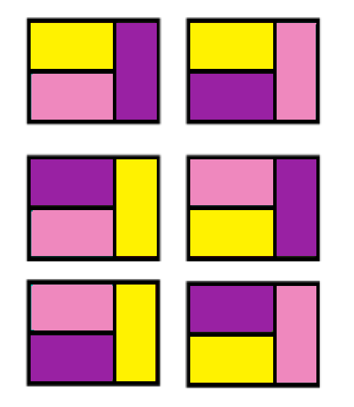

> PA - Tema 1
>
> \- Tehnici de Programare (si Gigel) -
>
> Responsabili:
>
> Andrei Preda, Cristian Pa˘trascu, Ioan Pop,
>
> Ioana Dabelea, Ioan Popescu, Alexandru Dima, Cristian Tudorache
>
> Deadline soft: **18.04.2024** **23:55** Deadline hard: **25.04.2024**
> **23:55**
>
> cuprins

1 Problema 1: Alimentare Servere 3 1.1 Enunt . . . . . . . . . . . . . .
. . . . . . . . . . . . . . . . . . . . . . . . . 3 1.2 Date de intrare
. . . . . . . . . . . . . . . . . . . . . . . . . . . . . . . . . . 3
1.3 Date de iesire . . . . . . . . . . . . . . . . . . . . . . . . . . .
. . . . . . . 3 1.3.1 Afisare . . . . . . . . . . . . . . . . . . . . . .
. . . . . . . . . . . . 3

> 1.4 Restrictii si preciza˘ri . . . . . . . . . . . . . . . . . . . . .
> . . . . . . . . . 4 1.5 Testare si punctare . . . . . . . . . . . . .
> . . . . . . . . . . . . . . . . . . 4 1.6 Exemple . . . . . . . . . .
> . . . . . . . . . . . . . . . . . . . . . . . . . . . 4
>
> 2 Problema 2: Colorare 5 2.1 Enunt . . . . . . . . . . . . . . . . . .
> . . . . . . . . . . . . . . . . . . . . . 5 2.2 Date de intrare . . .
> . . . . . . . . . . . . . . . . . . . . . . . . . . . . . . . 5 2.3
> Date de iesire . . . . . . . . . . . . . . . . . . . . . . . . . . . .
> . . . . . . 5 2.4 Restrictii si preciza˘ri . . . . . . . . . . . . . .
> . . . . . . . . . . . . . . . . 5 2.5 Testare si punctare . . . . . .
> . . . . . . . . . . . . . . . . . . . . . . . . . 6 2.6 Exemple . . .
> . . . . . . . . . . . . . . . . . . . . . . . . . . . . . . . . . . 6
>
> 3 Problema 3: Compresie 7 3.1 Enunt . . . . . . . . . . . . . . . . .
> . . . . . . . . . . . . . . . . . . . . . . 7 3.2 Date de intrare . .
> . . . . . . . . . . . . . . . . . . . . . . . . . . . . . . . . 7 3.3
> Date de iesire . . . . . . . . . . . . . . . . . . . . . . . . . . . .
> . . . . . . 7 3.4 Restrictii si preciza˘ri . . . . . . . . . . . . . .
> . . . . . . . . . . . . . . . . 7 3.5 Testare si punctare . . . . . .
> . . . . . . . . . . . . . . . . . . . . . . . . . 7 3.6 Exemple . . .
> . . . . . . . . . . . . . . . . . . . . . . . . . . . . . . . . . . 8
>
> 4 Problema 4: Criptat 9
>
> 1
>
> CUPRINS 2
>
> 4.1 Enunt . . . . . . . . . . . . . . . . . . . . . . . . . . . . . .
> . . . . . . . . . 9 4.2 Date de intrare . . . . . . . . . . . . . . .
> . . . . . . . . . . . . . . . . . . . 9 4.3 Date de iesire . . . . . .
> . . . . . . . . . . . . . . . . . . . . . . . . . . . . 9 4.4
> Restrictii si preciza˘ri . . . . . . . . . . . . . . . . . . . . . . .
> . . . . . . . 9 4.5 Testare si punctare . . . . . . . . . . . . . . .
> . . . . . . . . . . . . . . . . 9 4.6 Exemple . . . . . . . . . . . .
> . . . . . . . . . . . . . . . . . . . . . . . . . 10
>
> 5 Problema 5: Oferta 11 5.1 Enunt . . . . . . . . . . . . . . . . . .
> . . . . . . . . . . . . . . . . . . . . . 11 5.2 Date de intrare . . .
> . . . . . . . . . . . . . . . . . . . . . . . . . . . . . . . 11 5.3
> Date de iesire . . . . . . . . . . . . . . . . . . . . . . . . . . . .
> . . . . . . 11 5.4 Restrictii si preciza˘ri . . . . . . . . . . . . .
> . . . . . . . . . . . . . . . . . 12 5.5 Testare si punctare . . . . .
> . . . . . . . . . . . . . . . . . . . . . . . . . . 12 5.6 Exemple . .
> . . . . . . . . . . . . . . . . . . . . . . . . . . . . . . . . . . .
> 12

6 Punctare 13 6.1 Checker . . . . . . . . . . . . . . . . . . . . . . .
. . . . . . . . . . . . . . . 13

> 7 Folosire ChatGPT 14 8 Format arhiva˘ 14 9 Links 15
>
> problema 1: alimentare servere 3
>
> 1 problema 1: alimentare servere
>
> **1.1** **Enunt**
>
> Avem la dispozitie un grup de N servere, fiecare cu o putere de calcul
> proprie Pi. Serverele functioneaza˘ optim când sunt alimentate cu o
> cantitate de curent Ci. Daca˘ un server este subalimentat sau
> supraalimentat, puterea sa de calcul scade cu o unitate pentru fiecare
> unitate de curent *mismatched* (puterea finala˘ poate sa˘ fie
> **inclusiv** **negativa˘**).
>
> Suntem nevoiti sa˘ alimenta˘m toate serverele cu aceeasi cantitate de
> curent, dar, din fericire, controla˘m aceasta˘ cantitate. Care este
> puterea de calcul maxima˘ a sistemului, stiind ca˘ clusterul va fi
> **limitat** **de** **cea** **mai** **mica˘** **putere**
> **individuala˘**?
>
> **1.2** **Date** **de** **intrare**
>
> Pe prima linie din fisierul **servere.in** va fi numa˘rul de servere, N.
>
> Pe a doua linie vor fi N numere naturale reprezentând puterile de
> calcul ale serverelor (vectorul P).
>
> Pe a treia linie vor fi N numere naturale reprezentând limitele de
> alimentare ale serverelor (vectorul C).
>
> **1.3** **Date** **de** **iesire**
>
> În fisierul **servere.out** veti scrie puterea de calcul maxima˘ care
> poate fi atinsa˘, cea mai mica˘ dintre puterile individuale. Afisati
> puterea cu **exact** **o** **zecimala˘**.
>
> ***1.3.1*** ***Afisare***
>
> În C++ puteti folosi biblioteca \<iomanip\>, si functiile fixed ,i
> setprecision pentru a afisa un numa˘r cu o zecimala˘, astfel:
>
> *\#include* *\<iomanip\>*
>
> *//* *În* *interiorul* *unei* *functii*
>
> fout \<\< fixed \<\< setprecision(1) \<\< rezultat \<\< "**\n**";
>
> În Java puteti folosi metoda String.format, astfel:
>
> fout.println(String.format("%.1f", rezultat));
>
> problema 1: alimentare servere 4
>
> **1.4** **Restrictii** **si** **precizări**
>
> *•* 1 ⩽ N ⩽ 105, numa˘rul de servere *•* 1 ⩽ Pi ⩽ 109, puterile de
> calcul
>
> *•* 1 ⩽ Ci ⩽ 109, pragurile de alimentare optime
>
> *•* Toate numerele din datele de intrare sunt întregi.
>
> *•* Puterea de alimentare aleasa˘ de voi **poate** **sa˘** **nu**
> **fie** **numa˘r** **întreg**.
>
> **1.5** **Testare** **si** **punctare**
>
> *•* Punctajul maxim este de 25 puncte. *•* Timpul de executie:
>
> **–** C/C++: 1 **s** **–** Java: 2 **s**
>
> *•* Sursa care contine functia **main** trebuie obligatoriu denumita˘:
> **servere.c**, **servere.cpp** sau **Servere.java**.
>
> **1.6** **Exemple**
>
> problema 2: colorare 5
>
> 2 problema 2: colorare
>
> **2.1** **Enunt**
>
> Gigel a început sa˘ fie din ce în ce mai pasionat de pictura˘. Problema
> este, însa˘, ca˘ nu prea are talent, asa ca˘ a decis sa˘ îsi cumpere
> picturi pe numere. Uitându-se pe AlgoExpress, a ga˘sit o oferta˘ de
> nerefuzat pentru un tablou si a început sa˘ citeasca˘ mai multe despre
> el.
>
> Tabloul are o lungime de N centimetri si o la˘time de 2 centimetri,
> fiecare pa˘tra˘tel care trebuie colorat având o suprafata˘ de 1 cm2.
> Regulile de colorare sunt urma˘toarele:
>
> *•* nu poti folosi decât 3 **culori** (galben, roz si mov)
>
> *•* nu poti colora pa˘tra˘tele individuale, ci doar dreptunghiuri de
> dimensiune 1*×*2, asezate fie pe orizontala˘, fie pe verticala˘ (întreg
> dreptunghiul trebuie colorat cu aceeasi culoare)
>
> *•* doua˘ dreptunghiuri care au o **latura˘** **comuna˘** trebuie sa˘
> fie **colorate** **diferit**.
>
> Fascinat de acest tablou, Gigel a început sa˘ se gândeasca˘ în câte
> moduri diferite ar putea ara˘ta la final tabloul. Ajutati-l pe Gigel sa
> afle **numa˘rul** **de** **modele** **distincte**, modulo 109 +7.
>
> **2.2** **Date** **de** **intrare**
>
> Pe prima linie din fisierul **colorare.in** va fi un numa˘r natural, K.
>
> Pe a doua linie vor fi K perechi de forma “X T”, cu semnificatia:
> “urma˘toarele X zone din tablou sunt de tipul T (verticale sau
> orizontale)”.
>
> **2.3** **Date** **de** **iesire**
>
> În fisierul **colorare.out** veti scrie numa˘rul de tablouri distincte
> care se pot realiza, modulo 109 +7.
>
> **2.4** **Restrictii** **si** **precizări**
>
> *•* 1 ⩽ N ⩽ 2*∗*107, pentru 15 puncte.
>
> *•* 2*∗*107 ⩽ N ⩽ 1010, pentru alte 10 **puncte** **bonus**. *•* 1 ⩽ K
> ⩽ 105, numa˘rul de grupuri din input
>
> *•* 1 ⩽ X ⩽ N, numa˘r de zone consecutive cu aceeasi orientare.
> **Atentie**: o singura˘ “zona˘ orizontala˘” e formata˘ din doua˘
> dreptunghiuri orizontale, asezate unul peste altul.
>
> *•* T va fi caracterul “H” pentru zone orizontale, sau “V” pentru zone
> verticale.
>
> problema 2: colorare 6
>
> **2.5** **Testare** **si** **punctare**
>
> *•* Punctajul maxim este de 25 puncte. *•* Timpul de executie:
>
> **–** C/C++: 1 **s** **–** Java: 2 **s**
>
> *•* Sursa care contine functia **main** trebuie obligatoriu denumita˘:
> **colorare.c**, **colorare.cpp** sau **Colorare.java**.
>
>  style="width:2.6462in;height:3.0473in" />**2.6** **Exemple**
>
> problema 3: compresie 7
>
> 3 problema 3: compresie
>
> **3.1** **Enunt**
>
> Fie urma˘toarea operatie asupra unui sir de numere: se alege o
> subsecventa˘ din sir si se înlocuieste cu suma elementelor din
> subsecventa˘. De exemplu daca˘ avem sirul \[1, 6, 2, 4, 5\] si alegem
> subsecventa \[6, 2, 4\], obtinem \[1, 12, 5\].
>
> Pentru un sir A de lungime n si un sir B de lungime m, determinati
> daca˘ putem obtine doua˘ **siruri** **egale** prin 0 sau mai multe
> aplica˘ri ale operatiei definite mai sus, asupra lui A sau B, si aflati
> care e **lungimea** **maxima˘** pe care o poate avea sirul obtinut.
>
> **3.2** **Date** **de** **intrare**
>
> Pe prima linie din fisierul **compresie.in** va fi un numa˘r natural, n.
> Pe a doua linie vor fi n numere naturale, reprezentând sirul A.
>
> Pe a treia linie va fi un numa˘r natural, m.
>
> Pe a patra linie vor fi m numere naturale, reprezentând sirul B.
>
> **3.3** **Date** **de** **iesire**
>
> În fisierul **compresie.out** veti scrie un singur numa˘r întreg,
> lungimea maxima˘ a sirului rezultat, sau “−1”, în cazul în care nu
> putem obtine doua˘ siruri egale.
>
> **3.4** **Restrictii** **si** **precizări**
>
> *•* 1 ⩽ N,M ⩽ 3*∗*105 *•* 1 ⩽ Ai,Bi ⩽ 109
>
> **3.5** **Testare** **si** **punctare**
>
> *•* Punctajul maxim este de 25 puncte. *•* Timpul de executie:
>
> **–** C/C++: 1 **s** **–** Java: 2 **s**
>
> *•* Sursa care contine functia **main** trebuie obligatoriu denumita˘:
> **compresie.c**, **compresie.cpp** sau **Compresie.java**.
>
> problema 3: compresie 8
>
> **3.6** **Exemple**
>
> problema 4: criptat 9
>
> 4 problema 4: criptat
>
> **4.1** **Enunt**
>
> Ne dorim sa˘ construim un generator de parole puternice. Din acest
> motiv, vom încerca sa˘ construim parole cât mai lungi, pentru a fi mai
> greu de spart. Dar, pentru a ne diferentia generatorul de celelalte
> din piata˘, mai avem câteva criterii pe care vrem sa˘ le îndeplinim.
>
> Avem la dispozitie o lista˘ de N cuvinte care ne plac, si vrem sa˘
> forma˘m parola doar concatenând unele dintre aceste cuvinte (fiecare
> cuvânt poate fi folosit cel mult o data˘). În plus, vrem ca toate
> parolele pe care le producem sa˘ aiba˘ o litera˘ dominanta˘ (o litera˘
> care are strict mai multe aparitii decât juma˘tate din lungimea
> parolei).
>
> În aceste conditii, care este lungimea maxima˘ a parolei pe care o
> putem construi?
>
> **4.2** **Date** **de** **intrare**
>
> Pe prima linie din fisierul **criptat.in** va fi numa˘rul de cuvinte
> care ne plac, N. Pe urma˘toarele N linii se va afla câte un cuvânt.
>
> **4.3** **Date** **de** **iesire**
>
> În fisierul **criptat.out** veti scrie un singur numa˘r, lungimea
> maxima˘ a parolei.
>
> **4.4** **Restrictii** **si** **precizări**
>
> *•* 1 ⩽ N ⩽ 103, numa˘rul de cuvinte
>
> *•* 1 ⩽ L ⩽ 104, suma lungimilor cuvintelor din lista˘
>
> *•* Cuvintele sunt formate doar din litere mici ale alfabetului
> englez.
>
> *•* Numa˘rul de **litere** **distincte** folosite într-un test va fi
> **cel** **mult** **egal** **cu** 8.
>
> *•* Pentru testele acestei probleme vom putea mereu sa˘ forma˘m cel
> putin o parola˘.
>
> **4.5** **Testare** **si** **punctare**
>
> *•* Punctajul maxim este de 30 puncte. *•* Timpul de executie:
>
> **–** C/C++: 2 **s** **–** Java: 3 **s**
>
> *•* Sursa care contine functia **main** trebuie obligatoriu denumita˘:
> **criptat.c**, **criptat.cpp** sau **Criptat.java**.
>
> problema 4: criptat 10
>
> **4.6** **Exemple**
>
> problema 5: oferta 11
>
> 5 problema 5: oferta
>
> **5.1** **Enunt**
>
> Sunteti organizator pentru prima editie a hackathonului de
> algoritmica˘. Întrucât vreti ca toata˘ lumea sa˘ aiba˘ o experienta˘
> cât mai frumoasa˘, v-ati propus sa˘ cumparati consumabile (snacks,
> apa˘, sucuri etc.) de la un supermarket. Dupa˘ ce ati ajuns la casa˘
> si ati asezat cele N produsele pe banda rulanta˘, casierul v-a
> înstiintat ca˘ asta˘zi magazinul are doua˘ oferte atractive:
>
> 1\. Daca˘ grupati doua˘ produse, veti beneficia de o reducere de 50%
> **pentru** **produsul** **mai** **ieftin**.
>
> 2\. Daca˘ grupati trei produse, veti beneficia de o reducere de 100%
> **pentru** **produsul** **cel** **mai** **ieftin** (va fi gratis).
>
> Întrucât deja ati pus toate produsele pe banda˘, din lipsa˘ de timp
> puteti sa˘ **grupati** **doar** **produsele** **adiacente**. În
> schimb, nu sunteti obligati sa˘ grupati toate produsele, pe unele le
> puteti cumpa˘ra individual (dar trebuie sa˘ le cumpa˘rati pe toate).
>
> *•* Care este pretul **minim** pe care îl puteti obtine prin gruparea
> produselor de pe banda˘? (20p)
>
> *•* *(bonus)* Care este **al** K**-lea** **cel** **mai** **mic**
> **pret** **unic** pe care îl puteti obtine prin gruparea produselor de
> pe banda˘? (15p)
>
> **5.2** **Date** **de** **intrare**
>
> Pe prima linie din fisierul **oferta.in** vor fi numa˘rul N de produse
> de pe banda˘, si numa˘rul K. Pentru prima cerinta˘ vom avea K = 1.
>
> Pe a doua linie vor fi preturile celor N produse, în ordinea în care
> apar pe banda˘.
>
> **5.3** **Date** **de** **iesire**
>
> În fisierul **oferta.out** veti scrie un singur numa˘r, pretul cerut.
> Veti afisa pretul cu **exact** **o** **zecimala˘**. Puteti ga˘si
> indicatii pentru afisarea cu o zecimala˘ la problema **Servere**
> (Sectiunea 1.3.1).
>
> problema 5: oferta 12
>
> **5.4** **Restrictii** **si** **precizări**
>
> Pentru 20 de puncte:
>
> *•* 1 ⩽ N ⩽ 104, numa˘rul de produse
>
> *•* K = 1, deci trebuie sa˘ ga˘sim cel mai mic pret posibil *•* Suma
> tuturor preturilor nu va depa˘si 231 −1.
>
> Pentru alte 15 puncte:
>
> *•* 1 \< K ⩽ 104
>
> *•* În cazul în care nu exista˘ solutie veti afisa “−1”.
>
> **5.5** **Testare** **si** **punctare**
>
> *•* Punctajul maxim este de 35 puncte. *•* Timpul de executie:
>
> **–** C/C++: 3**.**5 **s** **–** Java: 4 **s**
>
> *•* Sursa care contine functia **main** trebuie obligatoriu denumita˘:
> **oferta.c**, **oferta.cpp** sau **Oferta.java**.
>
> **5.6** **Exemple**
>
> punctare 13
>
> 6 punctare
>
> *•* Punctajul temei este de 150 puncte, distribuit astfel:
>
> *•* Problema 1: 25**p**
>
> *•* Problema 2: 25**p** (dintre care 10**p** sunt bonus) *•* Problema
> 3: 25**p**
>
> *•* Problema 4: 30**p**
>
> *•* Problema 5: 35**p** (dintre care 15**p** sunt bonus)
>
> *•* 5 puncte vor fi acordate pentru comentarii si README.
>
> *•* 5 puncte vor fi acordate automat de checker pentru coding style.
> Totusi, la corectarea manuala se pot aplica **depuncta˘ri** **de**
> **pâna˘** **la** 20 **de** **puncte** pentru **coding** **style**
> **neadecvat**.
>
> Punctajul pe README, comentarii si coding style este conditionat de
> obtinerea unui punctaj strict pozitiv pe cel putin un test.
>
> Se poate obtine un bonus de 25**p** rezolvând testele bonus din cadru
> problemelor **Colorare** si **Oferta**, care reprezinta˘ variante mai
> dificile ale problemelor initiale. Acordarea bonusului **NU** este
> conditionata˘ de rezolvarea celorlalte teste/probleme. În total se pot
> obtine 150 de puncte (**NU** se trunchiaza˘).
>
> Pentru detalii puteti sa˘ va˘ uitati si peste [regulile
> generale](https://ocw.cs.pub.ro/courses/pa/regulament-general#teme) de
> trimitere a temelor. *•* O tema˘ care **NU** compileaza˘ va fi
> punctata˘ cu 0.
>
> *•* O tema˘ care **NU** trece niciun test pe vmchecker va fi punctata˘
> cu 0.
>
> *•* Vor exista mai multe teste pentru fiecare problema˘ în parte.
> Punctele pe teste sunt independente, punctajul pe un anumit test
> nefiind conditionat de alte teste.
>
> *•* Fiecare problema˘ va avea o limita˘ de timp pe test (precizata˘ pe
> pagina cu enuntul). Daca˘ executia programului pe un test al acelei
> probleme va dura mai mult decât limita de timp, veti primi automat 0
> puncte pe testul respectiv si executia va fi întrerupta˘.
>
> *•* În fisierul README.md va trebui **sa˘** **descrieti** **solutia**
> pe care ati ales-o pentru fiecare problema˘, **sa˘** **precizati**
> **complexitatea** pentru fiecare si alte lucruri pe care le considerati
> utile de mentionat.
>
> **6.1** **Checker**
>
> *•* Arhiva se va trimite pe
> [VMchecker](https://vmchecker.cs.pub.ro/ui/#PA), unde tema se va testa
> folosind un set de teste private.
>
> *•* Pentru testarea locala˘, aveti disponibil un set de teste publice
> (de aceeasi dificultate) pe pagina cu
> [resurse](https://curs.upb.ro/2023/mod/assign/view.php?id=151543) a
> temei.
>
> *•* Arhiva pe care o primiti (cu scheletul temei) contine fisierul
> README.checker.md, referitor la functionarea checker-ului. Va˘
> recomanda˘m sa˘ îl cititi. Checkerul este strict cu lucruri precum
> numele surselor voastre, numele regulilor din Makefile etc.
>
> *•* **Punctajul** **pe** **teste** este cel de pe VMchecker si se
> acorda˘ rulând tema doar cu testele private.
>
> folosire chatgpt 14
>
> *•* Checkerul verifica˘ doar existenta unui README cu denumire corecta˘
> (README.md) si continut nenul. **Punctajul** **final** **pe**
> **README** **si** **comentarii** se acorda˘ la corectarea manuala˘ a
> temei.
>
> *•* La corectarea manuala˘ se poate depuncta pentru **erori** **de**
> **coding** **style** care nu sunt semnalate de checker.
>
> *•* Corectorii îsi rezerva˘ dreptul de a sca˘dea puncte pentru orice
> problema˘ ga˘sita˘ în implementare, daca˘ vor considera acest lucru
> necesar.
>
> *•* Pentru citirea în Java se recomanda˘ folosirea
> [BufferedReader](https://ocw.cs.pub.ro/courses/pa/tutoriale/coding-tips#citire_si_scriere_mai_rapida).
>
> 7 folosire chatgpt
>
> *•* Folosirea ChatGPT, Copilot sau a orica˘rui model de limbaj sau
> tool (denumit in continuare **LLM**) ce va˘ poate ajuta la rezolvarea
> temei, cu idei sau cod, este puternic descurajata˘, dar nu interzisa˘.
>
> *•* În cazul in care folositi LLM-uri, trebuie sa˘ specificati acest
> lucru în README, precum si modul în care acestea au fost folosite (ex:
> ce prompt-uri ati folosit), pentru fiecare problema˘ pentru care au
> fost folosite tool-uri.
>
> *•* Pentru fiecare problema˘ rezolvata˘ folosind un LLM, pentru care a
> fost specificat în README acest lucru, se va aplica o penalizare de
> **33%** din punctajul acelei probleme.
>
> *•* În cazul în care o problema˘ este rezolvata˘ folosind un LLM, dar
> nu este specificat acest lucru in README, acest lucru se va considera
> **încercare** **de** **copiere** si se va sanctiona conform
> [regulamentului](https://ocw.cs.pub.ro/courses/pa/regulament-general#:~:text=%C3%8Encerc%C4%83rile%20de%20copiere%20se%20puncteaz%C4%83%20cu%20%2D1.25).
>
> 8 format arhivă
>
> *•* Temele pot fi testate automat pe VMchecker. Acesta suporta˘ temele
> rezolvate în C/C++ si Java.
>
> *•* Arhiva cu rezolvarea temei trebuie sa˘ fie **.zip**, având un nume
> de forma **Grupa_NumePrenume_Tema1.zip** (ex:
> 399CX_PuiuGigel_Tema1.zip) si va contine:
>
> *•* Fisierul/fisierele sursa˘ *•* Fisierul **Makefile**
>
> *•* Fisierul **README.md**
>
> *•* **ATENTIE!** Tema va fi compilata˘ si testata˘ **DOAR** **pe**
> **Linux**.
>
> *•* **ATENTIE!** Pentru cei ce folosesc C/C++ **NU** este permisa˘
> compilarea cu optiuni de optimizare a codului (-O1, -O2, etc.).
>
> *•* **ATENTIE!** Orice nerespectare a restrictiilor duce la pierderea
> punctajului (dupa˘ regulile de mai sus).
>
> links 15
>
> 9 links
>
> *•* [Regulament general
> PA](https://ocw.cs.pub.ro/courses/pa/regulament-general) *•* [Google
> C++ Style Guide](https://google.github.io/styleguide/cppguide.html)
> *•* [Google Java Style
> Guide](http://google.github.io/styleguide/javaguide.html)
>
> *•* [Debugging si Structuri de
> Date](https://ocw.cs.pub.ro/courses/pa/curs-optional/sd-si-debugging)
>
> *•* [Coding Tips pentru teme la PA
> (OCW)](https://ocw.cs.pub.ro/courses/pa/tutoriale/coding-tips)
